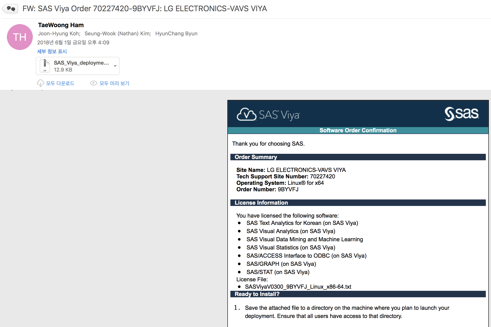
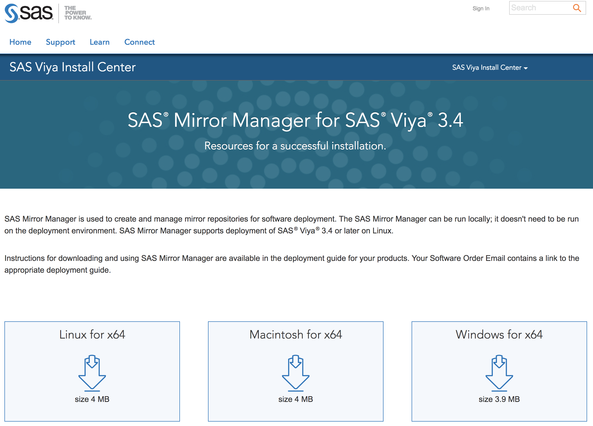

# SAS Viya Installation Guide for multi node

[TOC]


## 0. Viya 삭제

삭제시 자동으로 인스톨 디렉토리를 '_{sequence_number}'를 postfix 로 붙여 백업 하게 됩니다.

예를 들면 /opt/sas/viya 디렉토리는 /opt/sas/viya_{sequence_number} 로 변경 됩니다.

~~~{bash}
ansible-playbook deploy-cleanup.yml
~~~

## 1. 설치 사전 작업

### 1-1. 설치 환경

SAS Viya 설치 관련 내용은 아래와 같습니다..

SAS Viya 의 설치 이미지는 Viya3.4 부터 지원되는 mirror manager를 통해 다운받아 설치 하도록 합니다.

| 항목               | 내용                         |
| ------------------ | ---------------------------- |
| 설치 유저          | root                         |
| 설치 파일 위치     | /opt/install                 |
| SAS Viya 설치 위치 | /opt/sas/viya, /opt/sas/spre |

레드헷 리눅스의 경우 subscription 계약이 되어 있지 않다면, centos 리포지토리를 등록해서 Viya3.4 설치에 필요한 패키들을 다운 받을 수 있습니다.

vi /etc/yum.repository.d/centos.repo  

```
[base]
name=CentOS-$releasever - Base
baseurl=http://ftp.daum.net/centos/7/os/$basearch/
gpgcheck=1
gpgkey=http://ftp.daum.net/centos/RPM-GPG-KEY-CentOS-7

[updates]
name=CentOS-$releasever - Updates 
baseurl=http://ftp.daum.net/centos/7/updates/$basearch/
gpgcheck=1
gpgkey=http://ftp.daum.net/centos/RPM-GPG-KEY-CentOS-7

[extras]
name=CentOS-$releasever - Extras 
baseurl=http://ftp.daum.net/centos/7/extras/$basearch/
gpgcheck=1
gpgkey=http://ftp.daum.net/centos/RPM-GPG-KEY-CentOS-7

[centosplus]
name=CentOS-$releasever - Plus 
baseurl=http://ftp.daum.net/centos/7/centosplus/$basearch/
gpgcheck=1
gpgkey=http://ftp.daum.net/centos/RPM-GPG-KEY-CentOS-7

```


### 1-2. 유저 생성 및 디렉토리 생성

~~~bash
# 사용자 추가
useradd sas
useradd cas -g sas

# 인스톨 디렉토리 생성
mkdir -p /opt/install
chown -R sas:sas /opt
~~~


### 1-3. 설치시 필요 파일 리스트

아래 파일들을 다운 받아 ftp 접속이 가능한 유저의 디렉토리에 업로드 시킵니다.

| 파일명                       | 설명                                                     | 다운로드 링크                                                |
| ---------------------------- | -------------------------------------------------------- | ------------------------------------------------------------ |
| sas-orchestration-linux.tgz  | ansible playbook build (1-5 참조)                        | [다운로드](https://support.sas.com/en/documentation/install-center/viya/deployment-tools/34/command-line-interface.html) |
| mirrormgr-linux.tgz          | 설치 파일 다운로드 및 yum 로컬 리포지토리 구성 (1-6참조) | [다운로드](https://support.sas.com/en/documentation/install-center/viya/deployment-tools/34/mirror-manager.html) |
| SAS_Viya_deployment_data.zip | 라이센스 및 제품 목록 (1-4 참조)                         | 메일첨부                                                     |
| OpenLDAP-master.tar.gz       | 계정관리용 LDAP                                          | [다운로드](https://gitlab.sas.com/canepg/OpenLDAP) (SAS 네트워크) |


### 1-4. 파일 업로드.

SOE (SAS Order Email) 에 첨부된 SAS_Viya_deployment_data.zip 파일을 다운받아 서버의 HOME  디렉토리에 업로드




### 1-5. SAS CLI 유틸리티 다운로드

[SAS Viya Command line Interface Utility](https://support.sas.com/en/documentation/install-center/sas-viya/deployment-tools/command-line-interface.html)  웹사이트 에서 운영체제에 맞는 CLI 다운로드

다운로드 대상파일 : sas-orchestration.tgz


### 1-6. Mirror Manager 다운로드 및 설정 (3.4 이상)

다운로드 : [Mirror Manager 다운로드](https://support.sas.com/en/documentation/install-center/viya/deployment-tools/34/command-line-interface.html)



온라인으로 다운 받으면서 설치 할 경우 시간이 매우 오래 걸리기 때문에 가급적 mirror manager 를 사용하여 다운을 받은뒤 리포지토리 구성을 해준후 설치 합니다. 미러 리포지토리는 아래 두가지 방법으로 모든 노들들에 공유 되어야 합니다.

1. NFS 를 이용하여 모든 노드에 마운트
2. 웹서버를 이용하여 모든 노드가 접근 가능 하도록 설정

Viya3.4 인스톨을 위해서는 모든 노드에 웹서버가 설치 되어야 하기때문에 2번 방법을 이용 하도록 하겠습니다.


#### Mirror Manager 압축풀기

~~~
gunzip mirrormgr-linux.tgz
tar -xvf mirrormgr-linux.tar
~~~


#### SAS 미러 리포지토리 만들기

명령어 : mirrormgr mirror --deployment-data {path-to-SOE-file} --path {mirror-path} --platform {platform-tag} --log-file {log-file-path} --latest

```
./mirrormgr mirror --deployment-data /home/ec2-user/SAS_Viya_deployment_data.zip --path /opt/install/mirror --platform x64-redhat-linux-6 --log-file /home/ec2-user/mirrormgr.log --latest --workers 20
```

다운받은 미러 리포지토리는 웹서버나 NFS를 이용해서 모든 노드에서 리포지토리로 인식 가능 합니다.

하지만 추가적인 웹서버가 없거나 NFS 와 같은 공유 파일 시스템이 없을경우 해당 디렉토리를 tar 로 묶어 모든 노드의 동일한 디렉토리에 구성합니다. 본 가이드에서는 모든 서버의 /opt/install/mirror 디렉토리에 리포지토리를 구성하였습니다.

~~~
cd /opt/install
tar -cvf mirror.tar ./mirror
~~~

tar 로 압축한 파일을 scp, rsync ftp 등을 이용해서 다른 노드의 동일한 디렉토리에 전송하고 압축을 풉니다.

### hostname 설정

호스트네임을 설정하되 FQDN 으로 설정합니다. 예를 들면 viya.sas.com 이 FQDN 이 되고 viya 는 short hostname 이 됩니다.

```{bash}
hostnamectl set-hostname viya
hostnamectl set-hostname viya.sas.com --static
```

/etc/hosts 파일을 열어 아래와 같이 입력 합니다.

> FQDN 및 Short 네임을 같이 입력 합니다.

```{bash}
192.168.56.101 viya.sas.com viya
```

아래 명령어를 통해 호스트네임을 검증합니다.

```{bash}
hostname -f # FQDN 출력
hostname -s # shot hostname 출력
hostname # FQEN 출력
```


#### Hostname 을 각 노드의 /etc/hosts 파일에 등록

~~~
192.168.56.101 casc.mycompany.com
192.168.56.102 casw1.mycompany.com
192.168.56.103 casw2.mycompany.com
192.168.56.104 casw3.mycompany.com
~~~

> 웹서버 설치 전에 호스트 파일을 먼저 변경 하는 것은 웹서버 인증서가 호스트 파일 을 기본으로 생성 되기 때문입니다.
>
> 웹서버 설치후에 호스트 파일을 변경하게 되면 Viya설치시 에러가 발생 합니다. 이때는 mod_ssl 을 삭제하고 재설치 하면 새로운 호스트 파일의 이름으로 인증서를 만들게 되고 이후 새롭게 viya 를 설치 하면 됩니다.


### 1-7 Ansible Playbook 생성

####  JDK 설치

Ansible playbook 을 생성을 위해 sas-orchestration 명령어를 사용하게 되며, 명령어 수행을 위해 jdk 인스톨이 필요합니다.

SAS Viya 에서는 아래 두가지 JDK 를 권장합니다.

1. OpenJDK 1.8.x 이상
2. OracleJDK 1.8.x 이상
3. Azul zulu version 1.8.x 이상

> OpenJDK7 이상 부터는 Oracle Idk 와 성능 차이가 거의 없으며 안정성 또한 많은 상용기업에서 사용하고 있기 때문에 문제가 되지 않습니다. 

~~~bash
yum install java-1.8.0-openjdk-devel
~~~


#### Ansible Playbook 생성

Ansible 을 통해 Viya3.4 설치를 위해 ansible-playbook 을 생성 합니다. SOE 메일에 적힌 라이센스 허가 목록에 대해서만 Ansible playbook이 자동 생성 됩니다.

```
# 압축 풀기
gunzip sas-orchestration.tgz
tar -xvf sas-orchestration.tar

# Ansible Play Book 생성
./sas-orchestration build --input /home/ec2-user/SAS_Viya_deployment_data.zip --repository-warehouse "file:///opt/install/mirror" --platform redhat

# 플레이북 파일 install 디렉토리로 이동
cp SAS_Viya_playbook.tgz /opt/install/

# 플레이북 압축 풀기
cd /opt/install
tar -xvf SAS_Viya_playbook.tgz
```

> Platform TAG 정보는 oracle linux , redhat linux 의 경우 **redhat**, 수세리눅스의 경우 **suse**

### 1-8. SSH 키생성 및 복사

#### root 유저 키생성

ssh key 를 생성하게 되면 /root/.ssh 디렉토리 밑에 id_rsa(개인키), id_rsa(공개키) 가 만들어 집니다.

~~~bash
ssh-keygen -t rsa -N "" -f ~/.ssh/id_rsa
~~~

#### ssh 키복제를 위한 sshd 데몬 설정 및 재가동

/etc/ssh/sshd_config 열어서  PasswordAuthentication 을 yes 로 변경(no 부준을 주석처리)

~~~bash
PasswordAuthentication yes
#PermitEmptyPasswords no
#PasswordAuthentication no
~~~

또는

~~~
sed -i.bak -e 's/\#PasswordAuthentication yes/PasswordAuthentication yes/g' /etc/ssh/sshd_config;sed -i.bak -e 's/PasswordAuthentication no/\#PasswordAuthentication no/g' /etc/ssh/sshd_config;service sshd restart
~~~


#### sshd 데몬 재가동

~~~
systemclt restart sshd
~~~


#### root 유저 키복사

터미널창 4개를 열어서 동시전송으로 차례대로 4개를 입력합니다. 패스워드를 물어보면 입력합니다.

~~~
ssh-copy-id casc.mycompany.com
ssh-copy-id casw1.mycompany.com
ssh-copy-id casw2.mycompany.com
ssh-copy-id casw3.mycompany.com
~~~


#### sshd 설정원복

/etc/ssh/sshd_config 열어서  PasswordAuthentication 을 yes 로 변경(no 부준을 주석처리)

```bash
#PasswordAuthentication yes
#PermitEmptyPasswords no
PasswordAuthentication no
```

또는

~~~
sed -i.bak -e 's/PasswordAuthentication yes/\#PasswordAuthentication yes/g' /etc/ssh/sshd_config;sed -i.bak -e 's/\#PasswordAuthentication no/PasswordAuthentication no/g' /etc/ssh/sshd_config;service sshd restart
~~~


#### sshd 데몬 재가동

```
systemclt restart sshd
```


## 2. 요구 Package 설치 및 OS 설정 변경(튜닝)

### 2-1. epel YUM Repository 추가

Peel 리포지토리의 경우 redhat 및 기본 리포지토리에 python-pip 등의 python 관련 패키지가 포함되어 있지 않기 때문에 반듯이 추가 하여야 합니다.

yum install -y https://dl.fedoraproject.org/pub/epel/epel-release-latest-${majversion}.noarch.rpm

~~~bash
yum install -y https://dl.fedoraproject.org/pub/epel/epel-release-latest-7.noarch.rpm
~~~

> $majversion 에 리눅스 버전 추가 
>
> redhat 7.4 일경우 $majversion 은 7


### 2-2 요구 소프트웨어 설치

````
# 운영체제 확인
cat /etc/*-release

m
# sudo 권한 확인
sudo -v

# systemd 버전확인 (219 ~230버전)
rpm -qa systemd

# 필요하면 systemd 업데이트
yum update systemd

# HTTPD 확인
service httpd status

# 필요시 HTTPD 설치
yum install httpd

# Viya3.4 설치를 위한 요구 패키지 설치 스크립트 .sh 파일로 저장한후 실행 하면 자동 설치 됩니다.
pkgs="                    \
 at                       \
 nfs-utils.x86_64         \
 nfs-utils-lib.x86_64     \
 gcc                      \
 glibc                    \
 firefox                  \
 compat-libstdc++-33      \
 compat-glibc             \
 GLIBC 2.12               \
 libuuid                  \
 libSM                    \
 libXrender               \
 fontconfig               \
 libstdc++                \
 zlib                     \
 apr                      \
 ksh                      \
 numactl                  \
 perl-Net-SSLeay          \
 libXext                  \
 libXext.i686             \
 libXp                    \
 libXp.i686               \
 libXtst                  \
 libXtst.i686             \
 libgcc                   \
 libgcc.i686              \
 libpng12                 \
 libpng12.i686            \
 python 2.7               \
 xterm                    \
 xauth                    \
 libXmu                   \
 uuid                     \
 mod_ssl                  \
 tcl                      \
"
yum install  $pkgs -y

# 방화벽 중단
service firewalld stop
systemctl disable firewalld.service

# Selinux 중단
sestatus 
#만약 활성화 상태일 경우 모든 타겟 서버에 다음 명력을 통해 permissive mode 를 활성화 함

setenforce 0
sed -i.bak -e 's/SELINUX=enforcing/SELINUX=permissive/g' /etc/selinux/config

# epel 이 제대로 추가 되었는지 확인
sudo yum repolist

# root 계정으로 /opt 하위에 sas/cascache 디렉토리 생성. 
# cascache 디렉토리에 chmod 777 cascache 명령어를 통해 권한 부여 
mkdir -p /opt/sas/cascache
chmod 777 /opt/sas/cascache
````


### 2-3 Ansible 설치

+ Ansible 설치를 위한 패키지 설치

~~~bash
yum install -y python python-setuptools python-devel openssl-devel
yum install -y python-pip gcc wget automake libffi-devel python-six
~~~

+ Epel 삭제

~~~
yum remove -y epel-release
~~~

+ PIP 업그레이드

redhat linux 6.x 대

~~~
pip install --upgrade pip==9.0.3
~~~

redhat linux 7.x 대

~~~
pip install --upgrade pip setuptools
~~~


+ Ansible 설치

~~~
pip install ansible==2.3.1
~~~

+ 설치 확인

~~~
ansible --version
ansible localhost -m ping
~~~


### 2-4 커널변수 튜닝

아래 튜닝 항목들은 운영을 위한 최소 튜닝 방법 이므로 추가적은 성능 튜닝은 [SAS Viya 튜닝 가이드](http://documentation.sas.com/api/docsets/caltuning/3.4/content/caltuning.pdf?locale=en)를 참조 바랍니다.

+ /etc/ssh/sshd_config 파일 수정

~~~
MaxStartups 100
MaxSessions 100
~~~

~~~bash
sed -i.bak -e 's/\#MaxStartups 10:30:100/MaxStartups 100/g' -e 's/\#MaxSessions 10/MaxSessions 100/g' /etc/ssh/sshd_config
~~~


+ /etc/security/limits.conf 파일 수정

~~~
*	soft	nproc	100000
*	hard	nproc	100000
*	soft	nofile	350000
*	hard	nofile	350000
*	soft	stack	10240
*	hard	stack	32768
sas	-	nofile	150000
*	-	nofile	150000
sas	-	stack	10240
~~~

~~~
cat <<EOT >> /etc/security/limits.conf
* soft nproc 100000
* hard nproc 100000
* soft nofile 350000
* hard nofile 350000
* soft stack 10240
* hard stack 32768
sas - nofile 150000
* - nofile 150000
sas - stack 10240
EOT
~~~

+ /etc/security/limits.d/20-nproc.conf 파일 수정

~~~bash
*          soft    nproc     150000
root       soft    nproc     unlimited
*       -       nproc   100000
~~~

+ /etc/sysctl.conf 파일 수정

~~~
kernel.shmmni = 4096
kernel.sem = 512 32000 256 1024
net.core.somaxconn = 2048
net.ipv4.ip_local_port_range = 9000 65500
net.core.rmem_default = 262144
vm.max_map_count=262144
vm.overcommit_memory=0
~~~

~~~
cat <<EOT >> /etc/sysctl.conf 
kernel.shmmni = 4096
kernel.sem = 512 32000 256 1024
net.core.somaxconn = 2048
net.ipv4.ip_local_port_range = 9000 65500
net.core.rmem_default = 262144
vm.max_map_count=262144
vm.overcommit_memory=0
EOT
~~~


+ 설정 변경 확인

~~~
sysctl -p
~~~

+ /etc/systemd/system.conf 파일 수정

~~~
DefaultTimeoutStartSec=1800s
DefaultTimeoutStopSec=1800s
~~~

~~~bash
sed -i.bak -e 's/\#DefaultTimeoutStartSec=90s/DefaultTimeoutStartSec=1800s/g' -e 's/\#DefaultTimeoutStopSec=90s/DefaultTimeoutStopSec=1800s/g' /etc/systemd/system.conf 
~~~


### 2-5 hostname 확인

아래 호스트네임 명령 3가지 를 수행해서 나온 결과가 모두 같아야 합니다.

~~~
hostname
hostname -f
hostname -s
~~~


### 2.6 공유 디스크 마운트

만약 Controller 노드와 Backup Controller 노드를 구성 한다면,  /opt/sas/viya/config/data/cas 디렉토리를 공유 디스크로 구성 해야 합니다. 해당 폴더는 유저 컨텐츠가 저장 되는 디렉토리 입니다.

아마존을 예로 들어 설명하며, 아마존 aws 에는 efs 라는 공유 파일 서비스가 존재 합니다. efs 오브젝트를 생성하고 다음과 같이 모든 CAS 노드에 마운트 합니다.

efs URL 은 'fs-c46db425.efs.us-east-1.amazonaws.com' 이라고 가정합니다.

~~~
mkdir -p /opt/sas/viya/config/data/cas
chown -R sas:sas /opt/sas/viya/config
chmod -R 755 /opt/sas/viya/config
mount -t nfs4 -o nfsvers=4.1,rsize=1048576,wsize=1048576,hard,timeo=600,retrans=2,noresvport fs-c46db425.efs.us-east-1.amazonaws.com:/ /opt/sas/viya/config/data/cas
~~~


## 3.Installation

### 3-1 검증 및 인스톨

/opt/install/sas_viya_playbook 경로에서 다음 명령어 수행

~~~
cp samples/inventory_cas_multi_machine.ini inventory.ini
~~~

 inventory.ini 를 아래와 같이 편집합니다.

> 하나의 노드(장비) 에 대해 서로 다른 Alias 명을 사용하지 마십시요. 아래와 같이 모든 노드들이 서로다른 Alias 명을 가지고 있습니다. 

~~~
[host-definitions]
deployTarget ansible_connection=local internal_deployment_ipv4_override=192.168.56.101 self_deployment_ipv4_override=192.168.56.101 consul_bind_adapter=eth0

casw1 ansible_host=casw1.mycompany.com ansible_user=root ansible_ssh_private_key_file=~/.ssh/id_rsa self_deployment_ipv4_override=192.168.56.102 internal_deployment_ipv4_override=192.168.56.102 consul_bind_adapter=eth0

casw2 ansible_host=casw2.mycompany.com ansible_user=root ansible_ssh_private_key_file=~/.ssh/id_rsa self_deployment_ipv4_override=192.168.56.103 internal_deployment_ipv4_override=192.168.56.103 consul_bind_adapter=eth0

casw3 ansible_host=casw3.mycompany.com ansible_user=root ansible_ssh_private_key_file=~/.ssh/id_rsa self_deployment_ipv4_override=192.168.56.104 internal_deployment_ipv4_override=192.168.56.104 consul_bind_adapter=eth0

[sas-casserver-primary]
deployTarget

[sas-casserver-worker]
casw1
casw2
casw3
~~~


[casdatasvrc] 호스트 그룹의 호스트를 default 설정인 DeployTarget 으로 설정 하지 않을 경우(inventory.ini 파일에서 DeployTarget 이라는 명칭을 사용하지 않거나, 다른 노드에 설정 할 경우) , 3-2 의 var.yml 의 sasdatasvrc 항목을 수정 해야 합니다. [3-2 sasdatasvrc 수정] 참조 

### 3-2 vars.yml  수정

~~~BASH
# vi /opt/sas/install/sas_viya_playbook/vars.yml 를 입력하여 파일을 연 후 적절한 DEPLOYMENT_LABEL 을 설정
DEPLOYMENT_LABEL : "{{ DEPLOYMENT_ID}}"

# casenv_group 값을 cas가 속해 있는 그룹의 이름으로 설정
casenv_group : sas

# Full Deployment를 위하여 LDAP user를 cas admin user로 설정. casenv_admin_user의 값을 주석 해제 후 해당하는 user 이름으로 값 설정.
casenv_admin_user : cas

# CAS_DISK_CACHE를 주석 해제 후 /opt/sas/cacscache 로 경로 설정
CAS_DISK_CACHE : /opt/sas/cascache
~~~

 #### sasdatasvrc 수정


### 3-3 Validation 수행

/opt/sas/install/sas_viya_playbook/  에서 아래 명령어 수행하게 되면 모든 서버의 ssh 등의 통신 상태를 점검하고, yum 리포지토리 정보를 vars.yml 에 설정된데로 재설정합니다.

~~~bash
ansible-playbook system-assessment.yml 
~~~


### 3-4 Deployment 수행

/opt/sas/install/sas_viya_playbook/  에서 아래 명령어 수행

~~~
# 일반적인 방법
ansible-playbook -vvv site.yml

# 백그라운드 수행
nohup ansible-playbook -vvv site.yml &
~~~

> 백그라운드로 수행할 경우 deployment.log 및 nohup.out 을 확인하면 인스톨 상황을 알 수 있음


### 3-5 설치 모니터링 스크립트

~~~bash
while [ 1 ]
do 
	cat deployment.log | grep '"failed": true' 
	sleep 2
	clear
done
~~~

~~~bash
while [ 1 ]
do
cat yum.log | grep sas- | grep Installed | wc -l
sleep 2
done
# yum 로그를 통해 진행 정도를 알 수 있습니다. 
# Full 버전 설치시 : 640여개
# VA 설치시
# VA + VS 설치시
# VA + VS + VDMML 설치시
~~~


## 4. OpenLdap 설치 및 연동

Gitlab.sas.com 에서 다운받은 OpenLDAP 설치 파일이 있는 디렉토리로 이동하여 압축을 풉니다.

~~~
tar -xvf OpenLDAP-master.tgz
~~~

압축을 푼 디렉토리로 이동 합니다.

~~~{bash}
cd OpenLDAP-master
~~~

/group_vars/all.yml 및 inventory.ini 를 수정합니다.

### 4-1. all.yml 수정

inventory.ini 를 열어 수정 합니다. 

openldap 서버는 1곳에 설치 되고 , 모든 노드마다 openldap client 가 설치 되어 야합니다.

~~~
#####################################################################
## Enter your hosts definitions here!
## you can have one or more hosts
#####################################################################
# 설치될 서버로 호스트 주소를 적어 줍니다.casc 의 경우 ansible 이 설치된 노드이기 때문에
# local 로 해도 무방합니다.
casc     ansible_connection=local
casb	 ansible_host=casb.sas.com
casw1	 ansible_host=casw1.sas.com
statefull ansible_host=statefull.sas.com
stateless ansible_host=stateless.sas.com

#orange    ansible_host=server1.customer.com
#cherry    ansible_host=server2.customer.com
#raspberry ansible_host=server3.customer.com
#peach     ansible_host=server4.customer.com  ansible_ssh_user=root

#####################################################################
## This is how you tell the playbook where to install OpenLDAP SERVER
## there should be only one nickname in here
#####################################################################
[openldapserver]
casc  #openldap 서버 설치 노드

#####################################################################
## This/these servers will be configured to authenticate against the openldap server
## you may or may not want the same host here as in the openldapserver group
## this host group can have one or more machines in it
#####################################################################
[openldapclients] #openldap client 는 모든 노드에 설치
casc
casb
casw1
statefull
stateless
#####################################################################
## Don't touch the stuff below
#####################################################################
[openldapall:children]
openldapserver
openldapclients

~~~


### 4-2 inventory.ini 수정

Inventory.in 파일에서  아래와 같이 변경 합니다.

~~~{bash}
## you probably want to update these 2 variables.
DC: sas                   # OpenLDAP 서버의 이름
OLCROOTPW: "sask@123"     # admin 계정부터 이후 설정되는 모든계정의 default 패스워드 입니다.
~~~

**Tenant 리스트 수정**

~~~{bash}
tenantlist:
  - { ou: ou, name: "analytic" , objectClass1: "organizationalUnit" , objectClass2: "top"}
~~~

**Group 리스트 수정**

~~~bash
# these are the Groups. You can leave tenant blank if you want.
group_list:
  - { group: sasusers      , gid: 100001, desc: SAS Users,           member: [viyademo01, viyademo02],            tenant: "analytic"}

~~~

**User 리스트 수정**

~~~{bash}
# these are the Groups. You can leave tenant blank if you want.
user_list:
# regular users
  - { name: viyademo01, first: "Viya Demo", last: "User 01", uid: 100001, gid: 100001, pw: viyademo01, tenant: "analytic"}
  - { name: viyademo02, first: "Viya Demo", last: "User 02", uid: 100002, gid: 100001, pw: viyademo02, tenant: "analytic" }

~~~


### 4-3 OpenLDAP 설치

ansible을 이용해 openldap 을 설치 합니다.

~~~{bash}
ansible-playbook -vvv gel.openldapsetup.yml
~~~


### 4-4 sasboot 계정 설정 및 OpenLDAP 연동하기

/var/log/sas/viya/saslogon/default/ 로 이동헤서 가장 최근 로그에서  sasboot 계정의 패스워드 설정을 위한 URL 을 확인합니다.

```{bash}
grep sasboot ./{latest-saslogon-log-file}
```

아래와 같이 로그인 URL이 출력됩니다.


https://{hostname-or-ip}/SASLogon/reset_password?code={code} 로 접속하여 sasboot 계정의 패스워드를 설정하고 접속 합니다.

환경관리 > 구성 으로 이동하여 '뷰' 필터에서 '기본서비스' > 'identies service' 를 선택하면 아래와 같은 화면이 보입니다.


각각 connection, group, user 항목을 클릭하여 아래 **sitedefault.yml** 을 확인하여 수정 합니다.

```
## this file was auto-generated by the OpenLDAP Ansible playbook (https://gitlab.sas.com/canepg/OpenLDAP)
## make sure to review for accuracy.
config:
    application:
        sas.identities.providers.ldap.connection:
            host: 'casc.sas.com'
            port: '389'
            url: 'ldap://${sas.identities.providers.ldap.connection.host}:${sas.identities.providers.ldap.connection.port}'
            anonymousBind: 'false'
            userDN: 'uid=sasldap,ou=users,dc=sas,dc=com'
            password: 'sask@123'
        sas.identities.providers.ldap.group:
            accountId: 'name'
            baseDN: 'ou=groups,dc=sas,dc=com'
            createdDate: 'createTimestamp'
            distinguishedName: 'none'
            member: 'member'
            modifiedDate: 'modifyTimestamp'
            objectClass: 'groupOfNames'
            objectFilter: '(objectClass=groupOfNames)'
            searchFilter: 'dn={0}'
        sas.identities.providers.ldap.user:
            accountId: 'uid'
            baseDN: 'ou=users,dc=sas,dc=com'
            createdDate: 'createTimestamp'
            distinguishedName: 'none'
            memberOf: 'memberOf'
            modifiedDate: 'modifyTimestamp'
            objectClass: 'inetOrgPerson'
            objectFilter: '(objectClass=inetOrgPerson)'
            searchFilter: 'uid={0}'
        sas.identities:
            administrator: 'viyademo01'
```


### 4-5 등록된 유저 확인하기

환경관리 > 사용자 페이지로 가서 '뷰'를 '사용자' 로 설정하여 refresh 를 합니다. 일정 시간이 지나게 되면 아래 화면처럼 openldap 에 등록된 사용자가 보이계 됩니다.


## 5. Viya 서비스 기동 시 순서

Viya 시스템에 대한 시작 및 중지 시에는 아래 내용을 기준으로 수행 합니다.

### 5-1. SAS Configuration Server 및 Agent Start

프라이머리 노드에서 먼저 수행하고 나머지 노드 들에 대해 수행합니다.

~~~bash
# Redhat Linux 6
service start sas-viya-consul-default
~~~

~~~bash
# Redhat Linux 7
systemctl start sas-viya-consul-default
~~~


### 5-2. Vault(Secret Manager) 서비스 Start

해당 서비스가 존재하는 노드에 대해 수행합니다. (일반적으로 Primary node)

~~~bash
# Redhat Linux 6
service start sas-viya-vault-default
~~~

~~~bash
# Redhat Linux 7
systemctl start sas-viya-vault-default
~~~


### 5-3. Message Broker 서비스 Start

해당 서비스가 존재하는 노드에 대해 수행합니다. (일반적으로 Primary node)

~~~bash
# Redhat Linux 6
service start sas-viya-rabbitmq-server-default
~~~

~~~bash
# Redhat Linux 7
systemctl start sas-viya-rabbitmq-server-default
~~~


### 5-4. Data Server Service Start

~~~bash
# Redhat Linux 6
service start sas-viya-sasdatasvrc-postgres
~~~

~~~{bash}
# Redhat Linux 7
systemctl start sas-viya-sasdatasvrc-postgres
~~~


### 5-5. Httpd 서비스 Start

~~~{bash}
# Redhat Linux 6
service start httpd
~~~

~~~{bash}
# Redhat Linux 7
systemctl start httpd
~~~


### 5-6. 기타 서비스 모두 Start

Primary node 부터 수행후, 나머지 노드 수행

~~~bash
# Redhat Linux 6
service start sas-viya-all-services
~~~

~~~{bash}
# Redhat Linux 7
systemctl start sas-viya-all-services
~~~


## 부록

### 부록-1 Oracle Access

### 부록-2 Hadoop Access

### 부록-3 Hadoop EP 설치 및 연결

### 부록-3 Amazon Redshift